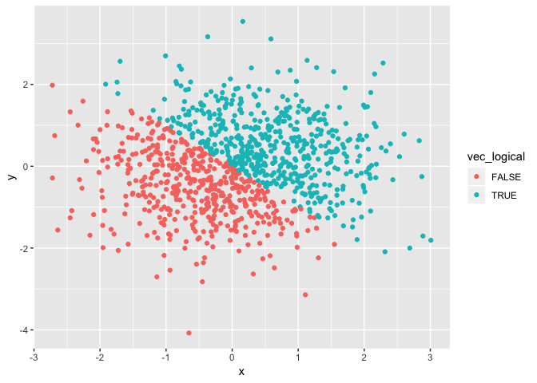
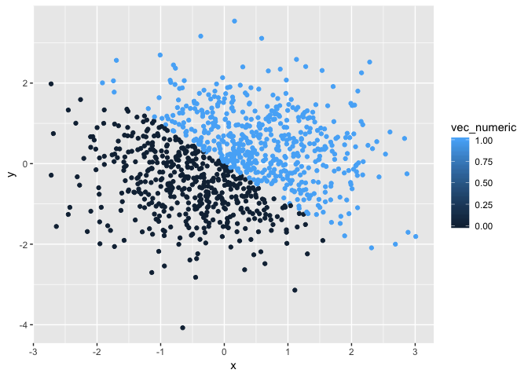
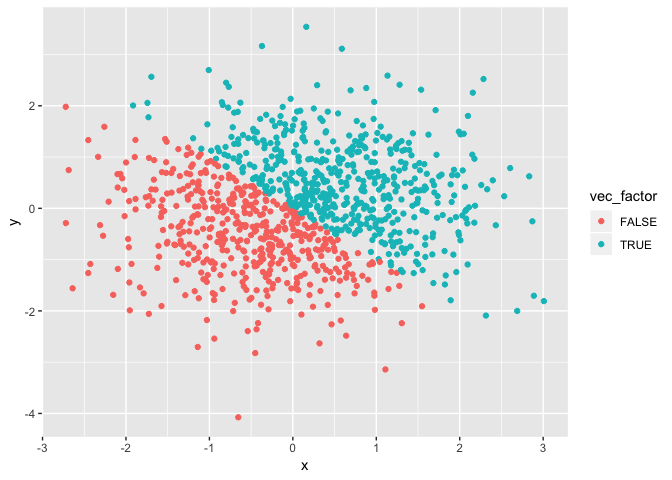

p8105\_hw1\_pm2995
================
Priyal
9/14/2018

Problem 1
=========

#### Creation of a data frame

``` r
set.seed(1)
df_1 = tibble( 
       random_samp = runif(10, 0, 5),
       greater_than_2 = random_samp > 2,
       student_name = c("Emma", "Sophia", "Serra", "Elisa", "John", "Jessica", "Ross", "Kaity", "Jo", "Luke"),
       study_year = factor(c("First" , "First", "Second", "First", "Third", "Second", "Second", "Third", "First", "First"))
)
```

#### Mean of each variable in data frame

-   Mean of random sample is 2.7575694

-   Mean of the logical vector greater\_than\_2 is 0.6

-   Mean of character variable is NA

-   Mean of factor variable is NA

Mean command did not work for variable student\_name and study\_year as they both are not numeric and logical variables respectively and hence their mean can not be calculated.

#### Applying as.numeric function

``` r
as.numeric(df_1$random_samp)
as.numeric(df_1$greater_than_2)
as.numeric(df_1$student_name)
```

    ## Warning: NAs introduced by coercion

``` r
as.numeric(df_1$study_year)
```

The as.numeric function worked for all the variables except the character variable (student\_name). For character variable it gave the warning: NAs introduced by coercion.

#### Converting variables from one form to the other

``` r
char_to_factor = as.factor(df_1$student_name)
factor_to_num = as.numeric(char_to_factor)
factor_to_char = as.character(df_1$study_year)
char_to_num = as.numeric(factor_to_char)
```

    ## Warning: NAs introduced by coercion

-   The as.factor function for the character variable (student name) created ten levels. Further converting it to numeric using as.numeric function, gave them a numeric value as per their alphabetical order.

-   The as.character function for the factor variable (study year) gave the same values that were inputed while making the data frame. Further converting it into the numeric gave the warning message; NAs introduced by coercion.

Problem 2
=========

``` r
set.seed(2)
df_2 = tibble(
  x = rnorm(1000),
  y = rnorm(1000),
  vec_logical = ((x + y) > 0),
  vec_numeric = as.numeric(vec_logical),
  vec_factor = as.factor(vec_logical)
)
```

#### Short description of the data set

-   The size of the dataset is 1000 x 5.

-   The mean and median of x are 0.0619987 and 0.0501354 respectively.

-   The proportion of cases for which logical vector is true is 0.53

#### Scatterplot of y vs x

``` r
ggplot(df_2, aes(x = x, y = y, color = vec_logical)) + geom_point()
```



``` r
ggsave("df_2plots_1.pdf")
```

    ## Saving 7 x 5 in image

``` r
ggplot(df_2, aes(x = x, y = y, color = vec_numeric)) + geom_point()
```



``` r
ggplot(df_2, aes(x = x, y = y, color = vec_factor)) + geom_point()
```



#### Comment on color scales:

We can see the similarity between the color scales of first and third scatter plot that are indicating TRUE and FALSE observations. The second scatter plot has the color scale ranging 0.00 to 1.00 value.
